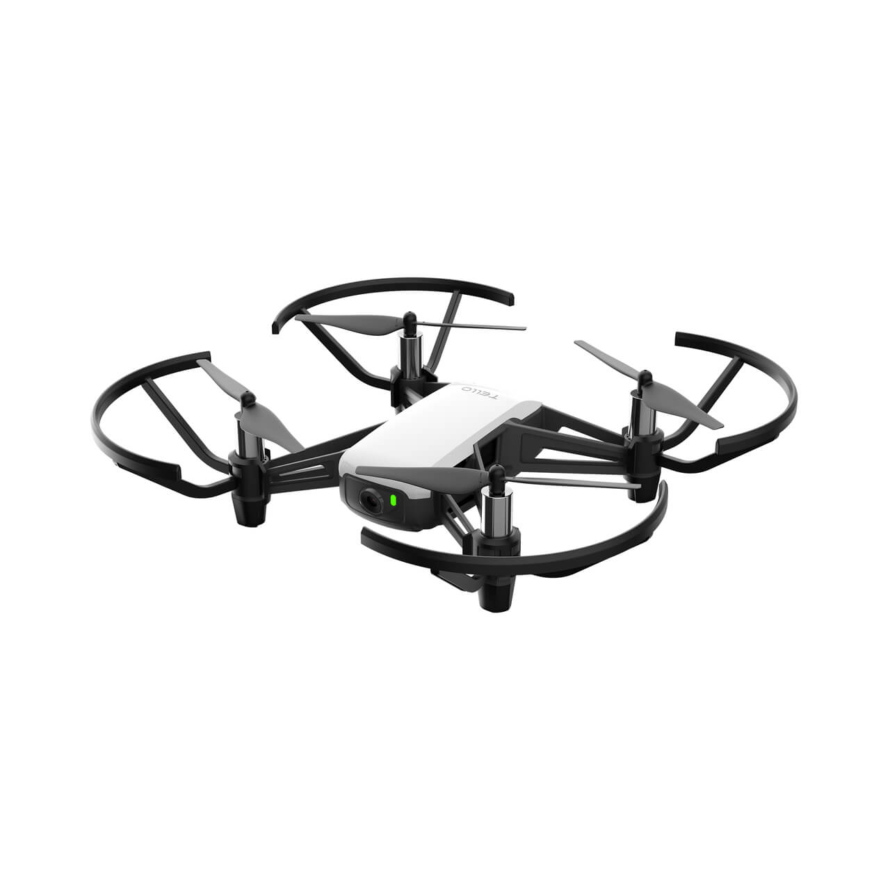
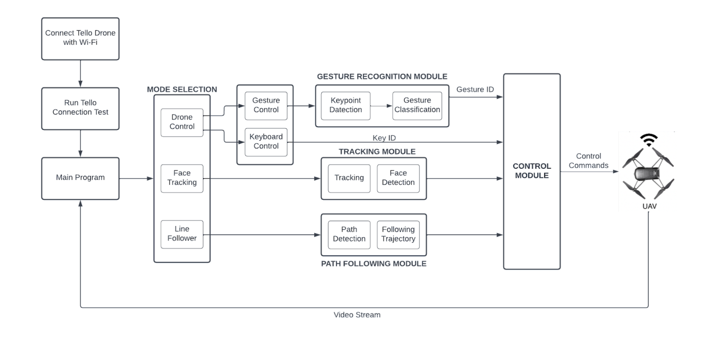
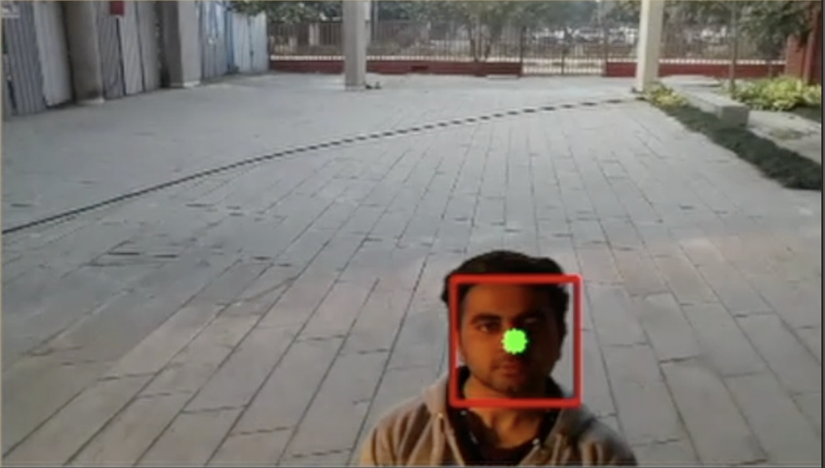
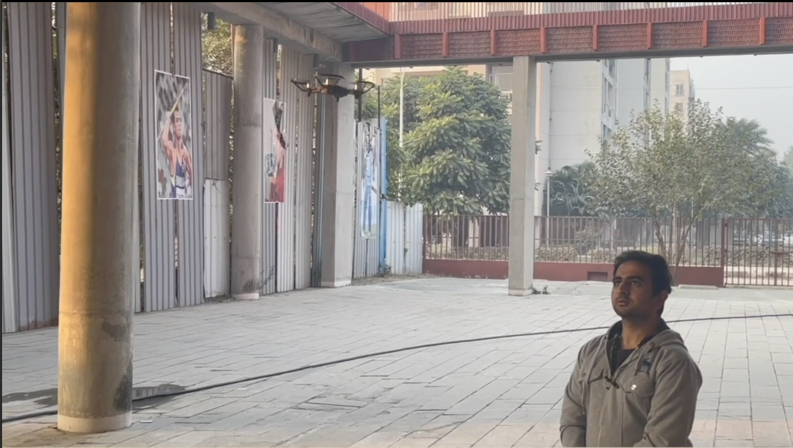
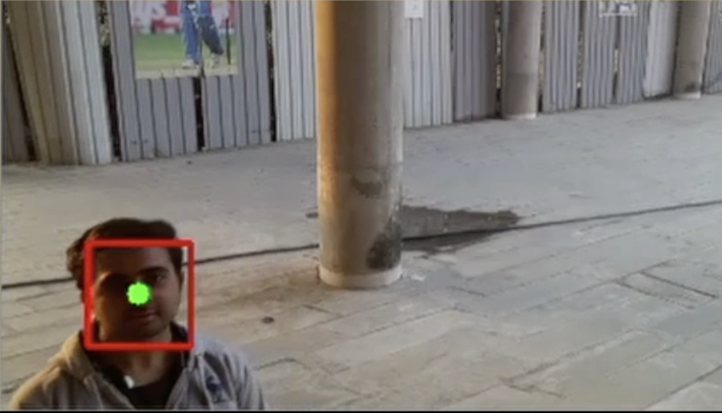
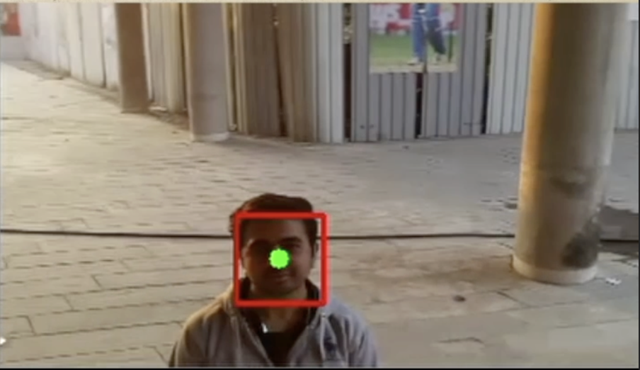
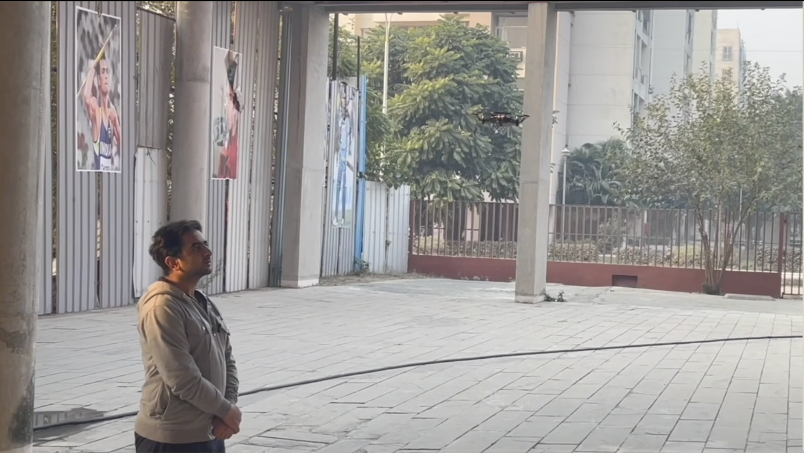

## Pushpak: A Smart UAV

 
Enhancement of the existing DJI TELLO drone and adding functionalities 
like Keyboard controls, Hand-gesture controls, Face-tracking, and Line-following 
using Deep Learning and Image Processing.
  

## :heavy_check_mark: Features
* A drone programmed to create a more personalized approach to control it using hand gestures.
* A drone programmed such that it will be capable of face tracking.
  It will be able to follow the person keeping a specific distance from him/her whose face the drone would have detected.
* A drone programmed to easily control it through the keyboard.

 

## :handshake: Contribution

Contributions are always welcomed, here is what you need to do:
1. Work on an existing issue or create a new one [here](https://github.com/mishrarahul07/Pushpak-A-smart-UAV/issues)
2. Create a pull request linked to that issue

Know more about [pull request](https://docs.github.com/en/free-pro-team@latest/github/collaborating-with-issues-and-pull-requests/about-pull-requests).

## :earth_asia: Video Demonstration

[Visit Here](https://drive.google.com/file/d/12CI_v1zibez8UByo4oBTDqINM4yGwFZI/view?usp=sharing)

## :computer: Demonstrative Snapshots

* <strong>Hand Gesture Controlling Module</strong>

  
  
  
  
  
  
  

* <strong>Face Tracking Module</strong>

  
  
  
  
  

* <strong>Keyboard Control Module</strong>

  
  

## :clipboard: Contributor
Connect Here:  <a href = "https://www.linkedin.com/in/mishra-rahul07/" target="_blank">Rahul Mishra</a>
